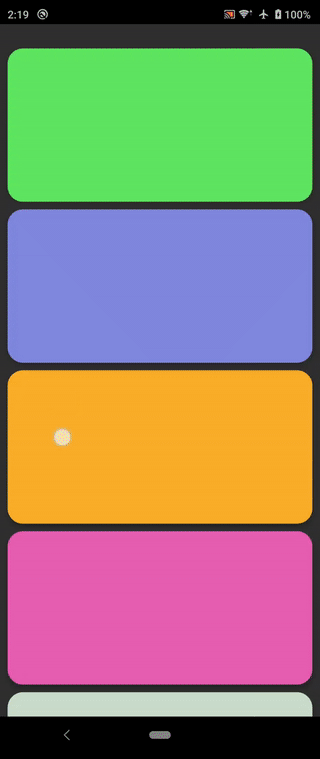
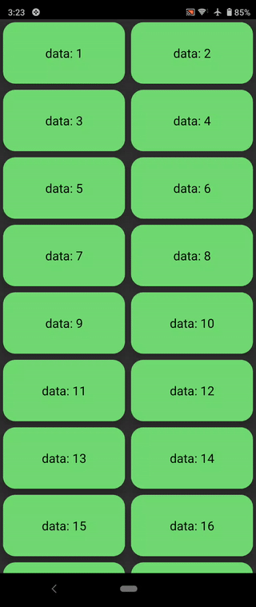

# Bouncy 

[](https://jitpack.io/#valkriaine/Bouncy)
[](https://android-arsenal.com/details/1/8218)

Add IOS-like overscroll animation to your scrolling views using [SpringAnimation](https://developer.android.com/guide/topics/graphics/spring-animation). 

Currently includes BouncyRecyclerView and BouncyNestedScrollView.

# Add Bouncy to your project

 ### Gradle
 
 Add it in your root build.gradle at the end of repositories:
 
  ```
 allprojects {
		repositories {
			...
			maven { url 'https://jitpack.io' }
		}
	}
 ```
  
 In your app module build.gradle, add dependency for `recyclerview` and `bouncy`:
```
   dependencies {
        implementation 'androidx.recyclerview:recyclerview:1.2.1'
        implementation 'com.github.valkriaine:Bouncy:2.1'
   }
 ```
 
# BouncyNestedScrollView

NestedScrollView with bouncy overscroll effect, currently only supports vertical scrolling. 

Achieved by overriding the default EdgeEffect

 

## Usage:

Use as normal NestedScrollView. Place it in your layout:

```xml
<com.factor.bouncy.BouncyNestedScrollView
        android:layout_width="match_parent"
        android:layout_height="match_parent"
        app:fling_animation_size=".7"
        app:overscroll_animation_size=".7">

    <LinearLayout
            android:orientation="vertical"
            android:layout_width="match_parent"
            android:layout_height="wrap_content">
            
            ...
            ...
            ...

    </LinearLayout>

</com.factor.bouncy.BouncyNestedScrollView>
```

```fling_animation_size``` specifies the magnitude of overscroll effect for fling, default is 0.5 if no value is given. 

```overscroll_animation_size``` specifies the magnitude of overscroll effect for drag, default is 0.5 if no value is given. 

Strongly suggest to keep both values lower than 5.

# BouncyRecyclerView

BouncyRecyclerView adds overscroll effect to RecyclerView and supports drag & drop and swiping gestures

 

## Usage:

Use as normal RecyclerView. Place it in your layout:

```xml
<com.factor.bouncy.BouncyRecyclerView
        android:id="@+id/recycler_view"
        android:layout_width="match_parent"
        android:layout_height="match_parent"
        app:recyclerview_fling_animation_size=".7"
        app:recyclerview_overscroll_animation_size=".7"
        app:recyclerview_damping_ratio="RECYCLERVIEW_DAMPING_RATIO_LOW_BOUNCY"
        app:recyclerview_stiffness="RECYCLERVIEW_STIFFNESS_MEDIUM"
        app:allow_drag_reorder="true"
        app:allow_item_swipe="false"/>
```

set up layout manager and adapter. Theoratically supports any LayoutManager: 
```java
   recycler_view.setAdapter(myAdapter);
   recycler_view.setLayoutManager(new LinearLayoutManager(context));
   //recycler_view.setLayoutManager(new GridLayoutManager(context, 3));
```

## Orientation 

1.8 version added support for both vertical scrolling and horizontal bounce animation

 

When you set the LayoutManager, ```BouncyRecyclerView``` will automatically detect the orientation of the layout. 

```java
   recycler_view.setLayoutManager(new LinearLayoutManager(context, LinearLayoutManager.HORIZONTAL, false));
```

If the bounce animation is incorrect, you can also manually set the animation orientation:

```java
   recycler_view.setOrientation(LinearLayoutManager.VERTICAL);
```

## Customization

```recyclerview_fling_animation_size``` specifies the magnitude of overscroll effect for fling, default is 0.5 if no value is given

```recyclerview_overscroll_animation_size``` specifies the magnitude of overscroll effect for drag, default is 0.5 if no value is given

```allow_drag_reorder``` and ```allow_item_swipe``` are set to false by default. If you would like to enable these features, simply set them to true.

### Spring customization

```recyclerview_damping_ratio``` and ```recyclerview_stiffness``` please refer to [damping ratio](https://developer.android.com/guide/topics/graphics/spring-animation#damping-ratio) and [stiffness](https://developer.android.com/guide/topics/graphics/spring-animation#stiffness)

Set in code:

```java
   recycler_view.setFlingAnimationSize(0.3f);
   recycler_view.setOverscrollAnimationSize(0.3f);
   recycler_view.setDampingRatio(Bouncy.DAMPING_RATIO_HIGH_BOUNCY);
   recycler_view.setStiffness(Bouncy.STIFFNESS_HIGH);
```

A known issue is when customizing spring properties, items close to the edges of the screen may be clipped since the current implementation animates the Y translation of the whole recyclerview. A workaround is to place the ```BouncyRecyclerView``` inside a ```NestedScrollView``` (not necessarily ```BouncyNestedScrollView```):

```xml
<androidx.core.widget.NestedScrollView 
            android:layout_width="match_parent" 
            android:layout_height="match_parent">

        <!--setting damping ratio to HIGH_BOUNCY may result in items being clipped near the edges-->
        <com.factor.bouncy.BouncyRecyclerView
                android:id="@+id/rc"
                android:layout_width="match_parent"
                android:layout_height="match_parent"
                app:recyclerview_damping_ratio="RECYCLERVIEW_DAMPING_RATIO_HIGH_BOUNCY"
                app:recyclerview_stiffness="RECYCLERVIEW_STIFFNESS_LOW"
                app:allow_drag_reorder="true"
                app:allow_item_swipe="true"/>
        
    </androidx.core.widget.NestedScrollView>
```

## Drag & drop 

Drag & drop does not work out of the box. 

For drag & drop or swipe gestures to work, make your adapter extend ```BouncyRecyclerView.Adapter```.
(If your adapter does not extend BouncyRecyclerView.Adapter, BouncyRecyclerView will simply disable the gestures)

```java
public class MyAdapter extends BouncyRecyclerView.Adapter
{
    private final ArrayList<MyData> dataSet;

    public MyAdapter(ArrayList<MyData> dataSet)
    {
        this.dataSet = dataSet;
    }

    @Override
    public RecyclerView.ViewHolder onCreateViewHolder(ViewGroup parent, int viewType)
    {
        View view = LayoutInflater.from(parent.getContext()).inflate(R.layout.list_item, parent, false);
        return new MyViewHolder(view);
    }

    @Override
    public void onBindViewHolder(RecyclerView.ViewHolder holder, int position)
    {
        MyViewHolder h = (MyViewHolder) holder;
        h.getTextView().setText(dataSet.get(position).getData());
    }

    @Override
    public int getItemCount()
    {
        return dataSet.size();
    }

    @Override
    public void onItemMoved(int fromPosition, int toPosition)
    {
        //*****must override to save changes 
        //called repeatedly when item is dragged (reordered)
        
        //example of handling reorder
        MyData item = dataSet.remove(fromPosition);
        dataSet.add(toPosition, item);
        notifyItemMoved(fromPosition, toPosition);
    }

    @Override
    public void onItemSwipedToStart(RecyclerView.ViewHolder viewHolder, int position)
    {
        //item swiped left
    }

    @Override
    public void onItemSwipedToEnd(RecyclerView.ViewHolder viewHolder, int position)
    {
        //item swiped right
    }

    @Override
    public void onItemSelected(RecyclerView.ViewHolder viewHolder)
    {
        //item long pressed (selected)
    }

    @Override
    public void onItemReleased(RecyclerView.ViewHolder viewHolder)
    {
        //item released (unselected)
    }
}
```
Also refer to the [Kotlin example](https://github.com/Valkriaine/Bouncy/blob/master/example/src/main/java/com/factor/example/MyAdapter.kt)

# My other projects

[Factor Launcher](https://github.com/Valkriaine/Factor_Launcher_Reboot) - A Windows Phone inspired launcher with some modern touch

[Mutify](https://github.com/Valkriaine/Mutify) - Automatically turn on do-not-disturb based on where you are

